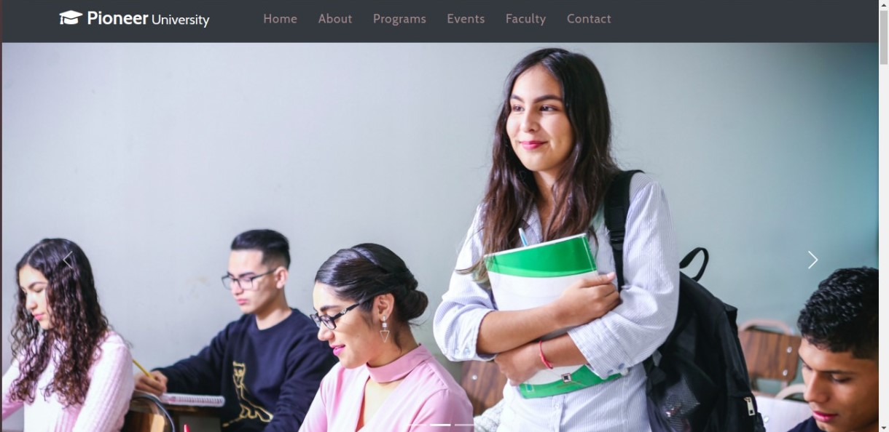
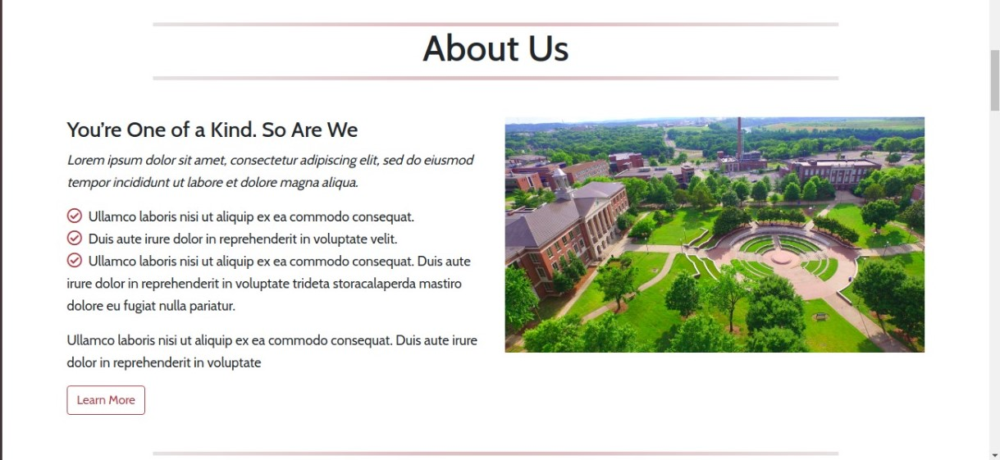

# PIONEER UNIVERSITY

### Table Of Contents

* Introduction
* Technologies Used
* References Of Used Code
* Key Features Of The Site

## Introduction

Pioneer University website is a responsive template website for schools/colleges.

## Technologies Used

* HTML5
* CSS3
* Bootstrap 5
* Google Fonts
* Font Awesome

## References Of Used Code

* [Bootstrap 5](https://v5.getbootstrap.com/docs/5.0/)
* [Stack Overflow](https://stackoverflow.com/)
* [W3Schools](https://stackoverflow.com/)

## Key Features Of The Site
* Responsive website
* Well structured and well designed code
* Reusable code for future use